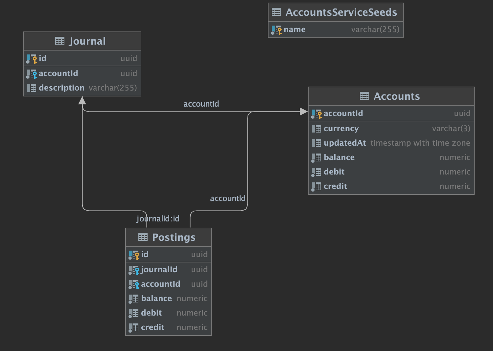
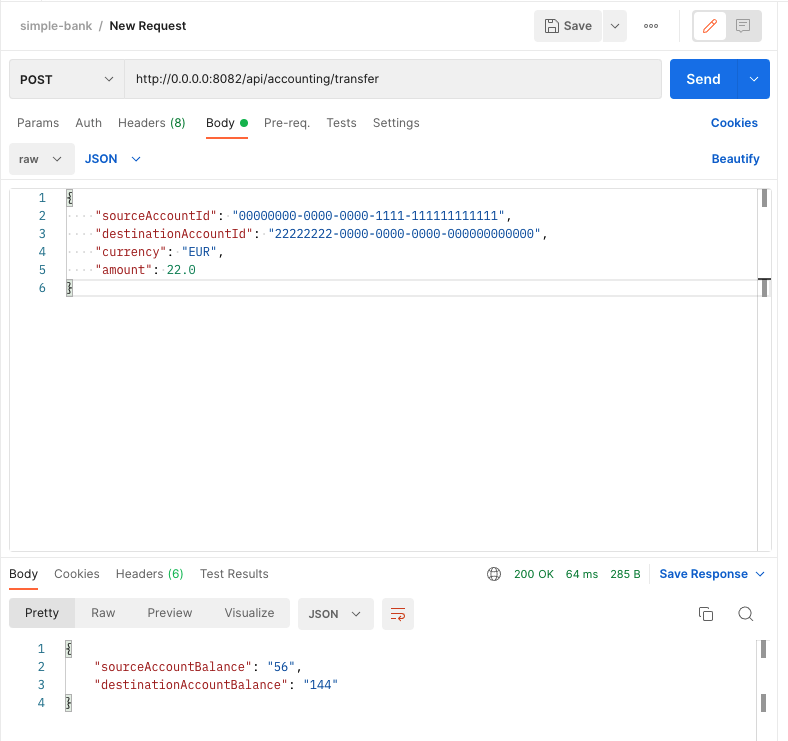

# ms-3-accounting
This is a [Moleculer](https://moleculer.services/)-based microservices project. 

## Project contents
Project consists of shared dev-ops repository for starting Docker with necessary tools (PostgreSQL, Kafka, Zookeeper)
and 2 microservices, one of them is `Api-Gateway`, second is `Accounting`. 

Microservices are using Kafka for communications. 
`Accounting` microservice is using PostgreSQL as a DB storage.
`API Gateway` starts to listen for incoming connections on a 8082 port, it doesn't 
have any predefined routes, it uses microservices auto-discover and builds routes for all available services within the same namespace.

Both `API Gateway` & `Accounting` microservice can be started with any number of instances (pods)) for scalability.
All instances of `Accounting` will share the same DB storage, so when the number of instances will increase,
pg-pool or other pooling solution must be used for carrying maximal number of connections.
PostgreSQL itself can be configured in many different ways to support replication, sharding and other dev-ops optimization stuff.

`Accounting` microservice has mechanisms for replaying database migrations and seeds. All necessary tables, triggers, functions are located in `src/db/migrations` and `src/db/seeders` folders.
Any time using a new postgreSQL instance, run these commands:
- `yarn build`, will create JS files from TypeScript files
- `yarn db:migrate` will create tables, indexes, trigggers and other stuff
- `yarn db:seed` will add to DB a couple of accounts for testing purposes.

## DB Structure

The Idea of DB structure is having a `Journal`, for recording What account and Why (description) made a transfer. Having the `Journal` `ID`,
we use `Postings` table for saving two transactions - one is credit from sourceAccount, another is debit to destination account.
Accountants use this double-write for ages, so we do also.
After the data was written, BEFORE and AFTER triggers in tables automatically calculate resulting balance in both tables.
Having Triggers for calculation and Foreign key constraints for associations tracking - create a simple, but bullet-proof solution for data consistency. 
So no one can spoil our DB, even playing with hands or SQL directly.

## Transfers
On a model level, there is a `TransferEngine` class, responsible for making transfers. It has only one public method for that, while other private are hidden from usage.
TransferEngine uses DependencyInjection for accessing DB.
All actions - adding to Journal, debit/credit double write, trigger calculations are wrapped with transaction, so if any step of this fail, the whole transaction and all changes will be rolled back.

## How to launch.
First got to all three folders and run `yarn` for installing node_modules.
Then go to ms-1-dev-tools, and run `docker-compose up`.
Now we have Kafka and PostgreSQL running.
Next we start `Accounting`, 
 - `cd ms-3-accounting`
 - `yarn build && yarn db:migrate && yarn db:seed`
 - `yarn dev`
Next we got to API Gateway
 - `cd ms-2-api-gateway`
 - `yarn build`
 - `yarn dev`

Then open Postman and make request to API Gateway

## Usage in REpl console
Start the project with `npm run dev` command. 
In the terminal, try the following commands:
- `nodes` - List all connected nodes.
- `actions` - List all registered service actions.
- `call accounting.account '{"id":"22222222-0000-0000-0000-000000000000"}'` - Get information about account with this id.

## Services
- **ms-2-api-gateway**: API Gateway services
- **ms-3-accounting**: Sample service for bank transactions

## NPM scripts

- `npm run dev`: Start development mode (load all services locally with hot-reload & REPL)
- `npm run start`: Start production mode (set `SERVICES` env variable to load certain services)
- `npm run cli`: Start a CLI and connect to production. Don't forget to set production namespace with `--ns` argument in script
- `npm run lint`: Run ESLint
- `npm run ci`: Run continuous test mode with watching
- `npm test`: Run tests & generate coverage report
- `npm run dc:up`: Start the stack with Docker Compose
- `npm run dc:down`: Stop the stack with Docker Compose
